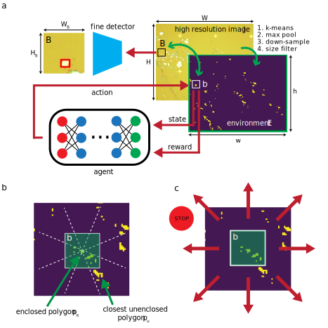
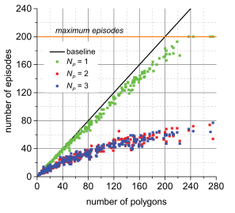

## Dynamic zoom-in detection of exfoliated two-dimensional crystals using reinforcement learning

  

(left) A high resolution image, (center) a downsampled, binary coarse image, (right) a zoomed-in image.

  

*Manuscript in progress:* https://arxiv.org/abs/2209.04467
  
The two-dimensional materials are an exciting platform for various studies because of their tunability and versatility. Despite the tremendous potential, device fabrication remains a major experimental challenge. One bottleneck is the process of searching for images of candidate crystals from an exfoliated bunch, which greatly vary in shapes and sizes. We propose the methods to accurately and efficiently search for desired crystals by zooming in, based on reinforcement learning and object detection. Our method utilizes the unique image settings of exfoliated crystals to reduce the computation power. The proposed method showed enhancement in average precision of ~0.5 compared to the baseline. Finally, we quantify the effectiveness of the reinforcement learning agent in the searching process.

------

  
  

(left) The architecture of the proposed methods, (right) efficiency of the reinforcement leanring agent in collecting polygons. The variable $N_P$ is the number of maximum polygon during training.

  

## Quick usage/test

1. `find_crystals.py` runs the RL agent and the fine scan detector to find crystals in a given image.
2. The output files (gif) are saved in the `output` folder.
3. There are three RL agents: NP1, NP2, NP3. Each of them corresponds to the respective plot in the above figure on the right.
4. Each agent can be called using the command `--rl_run_id=<agent name>`.
5. The input folder that contains images for evaulation can also be changed as `--images <image files directory>`.
6. Example: `python find_crystals.py --rl_run_id=NP3 --image_path=dataset/images`.
7. Feel free to play around with it/use your custom fine detector!
8. If you have any comments or suggestions, please reach me at stephank(at)princeton(dot)edu.
