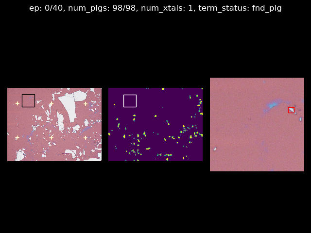
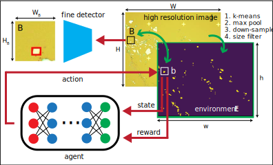

## Dynamic zoom-in detection of exfoliated two-dimensional crystals using reinforcement learning

  

(left) A high resolution image, (center) a downsampled, binary coarse image, (right) a zoomed-in image.

  

https://arxiv.org/abs/2209.04467
  
Owing to their tunability and versatility, the two-dimensional materials are an excellent platform to conduct a variety of experiments. However, laborious device fabrication procedures remain as a major experimental challenge. One bottleneck is searching small target crystals from a large number of exfoliated crystals that greatly vary in shapes and sizes. We present a method, based on a combination of deep reinforcement learning and object detection, to accurately and efficiently discover target crystals from a high resolution image containing many microflakes. The proposed method dynamically zooms in to the region of interest and inspects it with a fine detector. Our method can be customized for searching various types of crystals with a modest computation power. We show that our method outperformed a simple baseline in detection tasks. Finally, we analyze the efficiency of the deep reinforcement learning agent in searching crystals.

------

  

The reinforcement learning schematic for our method.

  

## Quick usage/test

1. `find_crystals.py` runs the RL agent and the fine scan detector to find crystals in a given image.
2. The output files (gif) are saved in the `output` folder.
3. There are three RL agents: NP1, NP2, NP3. Each of them corresponds to the respective plot in the above figure on the right.
4. Each agent can be called using the command `--rl_run_id=<agent name>`.
5. The input folder that contains images for evaulation can also be changed as `--images <image files directory>`.
6. Example: `python find_crystals.py --rl_run_id=NP3 --image_path=dataset/images`.
7. Feel free to play around with it/use your custom fine detector!
8. If you have any comments or suggestions, please reach me at stephank(at)princeton(dot)edu.
